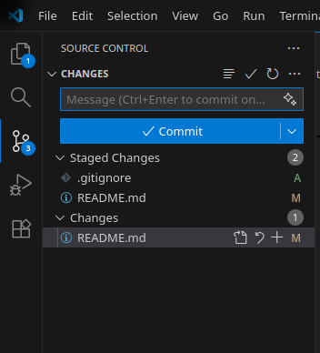

# FCSS Final Project - Group 3 (Analysis of the Privacy Paradox (2018–2024))

Group members:

- E
- Valentin Kaltenegger
- H
- H
- Kevin Paul

## Project Phases

**1. Data Collection & Preparation**

- **Source:** Google Trends (via Python/pytrends). Optionally: Reddit
- **Timeframe:** 2018–2024.
- **Target Region:** Worldwide.
- **Keywords:**
    * *Action-oriented:* "delete Facebook", "VPN", "GDPR", "encrypt".
    * *Product-oriented (Download Proxy):* "Signal", "Threema", "Telegram", "DuckDuckGo".
    * *Control Group:* "WhatsApp Web", "Instagram login".

> The category of keywords is preliminary. It may change according to our research.

**2. Event Categorization (The Independent Variables)**

There are in particular two situations that raises privacy concerns within the society:

* **Security Incidents:** Data breaches, leaks, scandals (e.g., Cambridge Analytica, Pegasus, Facebook leaks).

> This is preliminary. There are possibly more, but we need a paper or two to substantiate this point.

**Task:** Create a precise timeline table containing the event date, first media coverage date, and perceived severity level.

**3. Analysis Methodology**
* **Visual Analysis:** Overlay the event timeline on the search volume charts.
* **Decay Rate Calculation:** Measure how many days it takes for search volume to return to baseline after a peak.
* **Substitution Effect:** Analyze if a rise in privacy app searches correlates with a decline or stagnation in mainstream app searches.

---

## Timeline, Deliverables and Deadlines

Per Deliverable, we define two deadlines: a **Check-In** for reporting on the progress, and a **Hand-In**, where the deliverable is on the GitLab, if applicable.

0. Project Inception
    - Setting up the GitLab repository
    - Define the project scope
    - **Deadline**: 30.11.2025, 17:00
    - *Deadline 2* (if changes are necessary): 02.12.2025, 13:00
1. Data Retrieval
    - Finding a security incident and keywords (5 in total each one)
    - Finding Data (Google Trends) and uploading them to GitLab
    - Find literature about works that have analyzed Google Trends as well and what they have done so far (What keywords, when an increase of interest is considered significant, ...)
    - **Check-In**: 02.12.2025, 13:00 (or later, depending on the Project Inception)
    - **Deadline**: 07.12.2025, 23:59
2. Implementation
    - Performing analysis depending on the keywords and the security incidents
    - Finding correlations
    - Peak-to-Baseline Ratio & Decay rate
    - Performing a visual analysis
    - ...
    - **Check-In 1**: 09.12.2025, 13:00
    - **Check-In 2**: 16.12.2025, 13:00
    - **Deadline**: 03.01.2026, 23:59
3. Christmas Break buffer
4. Poster Design
    - **Check-In**: 06.01.2026, 13:00
    - **Deadline**: 11.01.2026, 23:59
5. **PRESENTATION Q&A**: ??.01.2026
6. **POSTER PRESENTATION**: 27.01.2026

Whoever misses a deadline (Check-In or Deadline) thrice and without notice, will be reported to the Lecturers team.

---

## GitLab Instructions

A little Beginner's guide

### How to get this repository on your computer

Use a client, like GitKraken. You will get it for free through the GitHub Student Developer Pack.

OR do the way through a few commands.

- Install Git
- Set your name and email for commits:
    - `git config --global user.name "FirstName LastName"`
    - `git config --global user.email "your.name@student.tugraz.at"`
- After installation: go to a directory and clone the repository.
    - Beginners (or the HTTPS way): `git clone https://gitlab.tugraz.at/CF2A2BC8BA507771/fcss2025-fpg3.git`. You will get a window to log in.
    - Pros (or the SSH way): `git clone git@gitlab.tugraz.at:CF2A2BC8BA507771/fcss2025-fpg3.git`
- Work. You can easily use VS Code to work on the project.

### How to track changes (Commit)

In a group project, it is mandatory to commit and push as much as possible.

- If you performed changes on core files: track them in VS Code.
- Stage the files you changed by pressing on the Plus (+) sign.
- Type in a meaningful commit message describing what you have done.
- Commit changes
- Push the Changes.

### How to push updates?

- Before that: get the latest updates: `git pull`. 
    - In the case of merge conflicts: Try to resolve it.
    - If you are unsure: Talk to Janniella or Kevin

